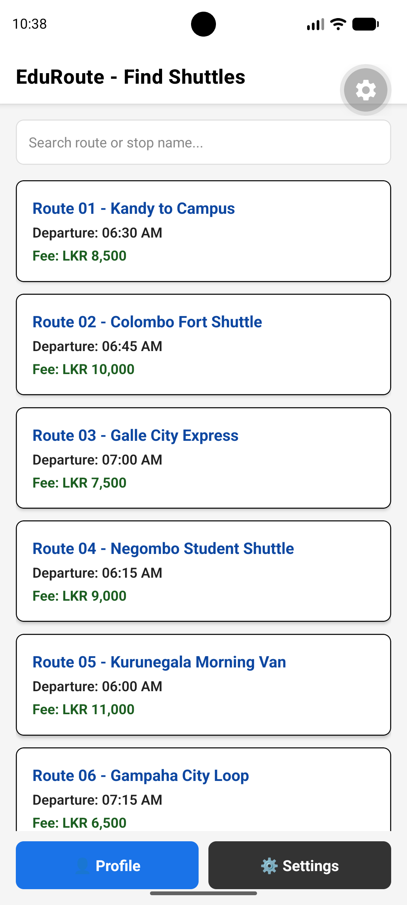
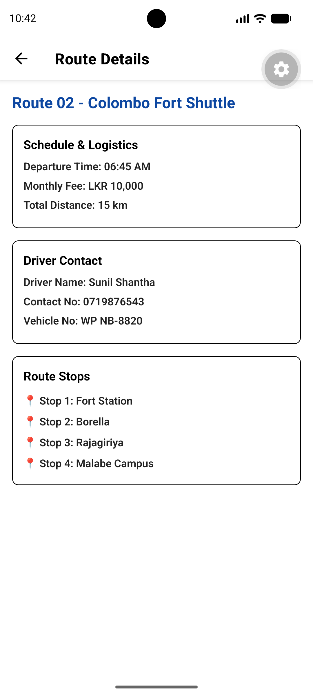
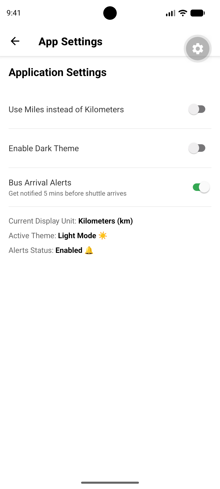
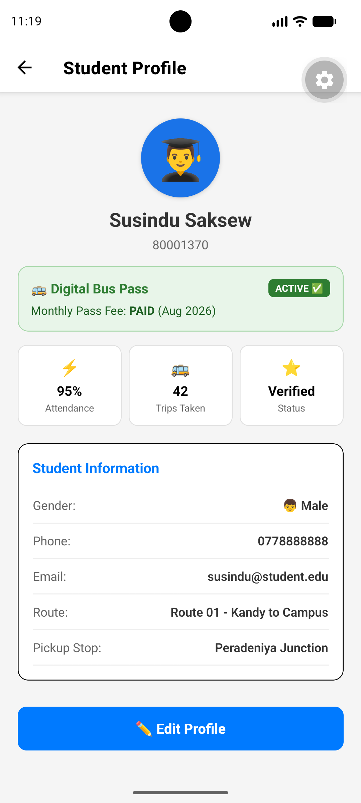

# EduRoute - Student Shuttle & Route Finder App

EduRoute is a mobile app developed with React Native and Expo to help university students find and check shuttle information more easily.

The app allows students to search for available shuttle routes and view details such as departure times, stops, distance, monthly fees, vehicle numbers, and driver contact details.

This project was developed for the **CSI2114 - Mobile Application Development Sprint 1 Assessment**.

---

## Main Features

### 1. Route Search and Listing

The Home Screen shows the available university shuttle routes in a list.

`FlatList` is used to display the routes so that users can scroll through them easily. A search bar is also available on the Home Screen.

Users can search using either the route name or the name of a stop. This makes it easier to find a route when the user only knows the pickup location.

If there are no matching routes, the app shows **"No routes found."**

---

### 2. Route Details

Users can select a route from the Home Screen to open the Route Details Screen.

The screen shows information about the selected route, including:

* Route name
* Departure times
* Monthly fee
* Driver contact number
* Vehicle number
* Route stops
* Total distance

Users can also change the distance display between **kilometres (km)** and **miles (mi)** from the Settings Screen.

---

### 3. Application Settings

The Settings Screen contains the main options that users can change.

#### Distance Unit

Users can choose:

* Kilometres (km)
* Miles (mi)

The selected unit is used when displaying route distances.

#### Dark Mode

The app has both **Light Mode** and **Dark Mode**.

The selected theme is shared between the screens using the React Context API. This means the theme can be changed from the Settings Screen and used throughout the application.

#### Bus Arrival Alerts

Users can turn shuttle arrival alerts on or off from the Settings Screen.

When the notification feature is enabled, the app can provide an alert five minutes before the scheduled shuttle arrival time.

---

## 4. Student Profile

The Profile Screen was designed to give students a place to manage their personal and shuttle-related information.

Users can view and update:

* Name
* Student ID
* Gender
* Phone number
* Email
* Shuttle route
* Pickup stop

### Profile Features

#### Edit Mode

The Profile Screen has an Edit Mode that allows users to change their details.

The `isEditing` state is used to control whether the profile is being edited. When editing starts, the current profile information is loaded into the form so the user can review it before making changes.

#### Gender Selection

Users can select their gender using the Boy and Girl buttons.

The selected gender is also used to change the profile avatar.

#### Dynamic Avatar

The profile avatar changes when the user changes the gender selection.

Both the avatar emoji and its background are updated to match the selected option.

#### Profile Data and Context

The Profile Screen uses `useContext` to work with the `SettingsContext`.

The context provides information such as:

* `userProfile`
* `isDarkMode`
* `updateUserProfile()`

This allows the profile information and application settings to be shared without passing the same data between every screen.

#### Digital Bus Pass

A digital bus pass section is included in the Profile Screen.

It shows information such as the current pass status and payment status. For example, an active pass can be shown as **ACTIVE **.

#### Quick Statistics

The Profile Screen also contains a small statistics section.

It can show:

* Attendance percentage
* Total trips taken
* Verification status

These details give the student a quick overview without having to open another screen.

#### Light and Dark Mode

The Profile Screen follows the theme selected by the user.

When Dark Mode is enabled, the background, text, input fields, cards, borders, and other interface elements are changed to suit the dark theme.

The same screen also works in Light Mode with lighter backgrounds and colours.

#### Profile Update Feedback

After the user successfully updates the profile, `Alert.alert()` is used to show a confirmation message.

This lets the user know that the changes have been saved successfully.

#### Scrollable Profile

The profile page uses `ScrollView` so that all the information and input fields can be accessed easily, especially on smaller screens.

---

## Profile Screen Code Structure

The main Profile Screen functionality is contained in `ProfileScreen.js`.

| Feature          | Used In The Application                                     |
| ---------------- | ----------------------------------------------------------- |
| State management | `useState` is used for form values and Edit Mode            |
| Context          | `SettingsContext` is used for shared profile and theme data |
| Profile editing  | `isEditing` controls the editing section                    |
| Gender selection | Buttons update the selected gender and avatar               |
| Bus pass         | Displays pass and payment information                       |
| Quick statistics | Shows attendance, trips, and verification details           |
| Theme            | `isDarkMode` changes the screen appearance                  |
| Feedback         | `Alert.alert()` shows the update confirmation               |
| Scrolling        | `ScrollView` contains the profile content                   |
| User input       | `TextInput` is used for editable information                |
| Buttons          | `TouchableOpacity` is used for profile actions              |

---

## Technologies Used

* **React Native** - Used to create the mobile application
* **Expo** - Used to run and test the application
* **JavaScript** - Main programming language
* **React Navigation** - Used to move between application screens
* **React Context API** - Used to share profile and application settings
* **AsyncStorage** - Used for local data storage
* **useState** - Used to manage component state
* **useEffect** - Used when side effects are required
* **useContext** - Used to access shared context values
* **FlatList** - Used to display the shuttle route list
* **ScrollView** - Used for scrollable content
* **Switch** - Used for settings controls
* **TextInput** - Used for search and profile input
* **TouchableOpacity** - Used for interactive buttons
* **Alert** - Used to show user feedback
* **View and Text** - Used to create the interface

---

## Application Structure

The project is divided into different folders to keep the code easier to manage.

The **screens** folder contains the main screens. Shuttle route information is kept in the **data** folder, while shared settings and profile information are handled through the **context** folder.

React Navigation is used for screen navigation.

The `SettingsContext` is used to share values such as the selected theme, distance unit, and student profile.

The Profile Screen accesses these shared values using `useContext`.

---

## Project Structure

```text
EDUROUTE/
│
├── assets/
│   └── screenshots/
│       ├── home.png
│       ├── detail.png
│       ├── settings.png
│       ├── profile.png
│       └── qrcode.png
│
├── context/
│   └── SettingsContext.js
│
├── data/
│   └── routesData.js
│
├── screens/
│   ├── HomeScreen.js
│   ├── DetailScreen.js
│   ├── SettingsScreen.js
│   └── ProfileScreen.js
│
├── scripts/
│   └── reset-project.js
│
├── android/
│
├── .vscode/
│
├── .gitignore
├── App.js
├── app.json
├── package.json
├── package-lock.json
├── README.md
└── tsconfig.json
```

---

## Important Files

### `HomeScreen.js`

Displays the available shuttle routes and handles route searching.

### `DetailScreen.js`

Shows the information for the route selected by the user.

### `SettingsScreen.js`

Contains the distance unit, theme, and notification settings.

### `ProfileScreen.js`

Handles student profile information, editing, gender selection, the digital bus pass, quick statistics, and theme changes.

### `SettingsContext.js`

Contains shared application and profile information that is used by different screens.

### `routesData.js`

Contains the sample shuttle routes used in the application.

### `App.js`

Sets up the main application and navigation between the screens.

---

## Getting Started

### 1. Clone the Repository

Clone the project from GitHub and open the folder in Visual Studio Code.

```bash
git clone https://github.com/susindusaksew/EduRoute.git
cd EduRoute
```

### 2. Install Dependencies

Run:

```bash
npm install
```

If AsyncStorage is not already installed, run:

```bash
npx expo install @react-native-async-storage/async-storage
```

### 3. Start the Application

Start the Expo development server:

```bash
npx expo start -c
```

After the server starts, the application can be opened using **Expo Go** or an Android emulator.

---

## Sprint 1 Objectives

The main goal of Sprint 1 was to build the basic structure of the EduRoute app and implement the main features needed for the prototype.

The project demonstrates:

* Multiple application screens
* Screen navigation
* Shuttle route listing
* Route searching
* `FlatList`
* `useState`
* `useEffect`
* `useContext`
* React Context API
* AsyncStorage
* Light and Dark Mode
* Distance unit conversion
* Student profile editing
* Student ID management
* Gender selection
* Dynamic avatar
* Digital bus pass information
* Quick statistics
* User feedback with `Alert.alert()`

---

## Project Purpose

The main idea of EduRoute is to make university shuttle information easier for students to find.

Students may need to check the route, pickup stop, departure time, fee, distance, vehicle number, or driver contact details before travelling.

Instead of looking for this information in different places, the app provides the main details in one place.

The Profile Screen also gives students a way to manage their own information and check shuttle-related details such as their bus pass and travel statistics.

This Sprint 1 version provides the basic structure that can be improved with more features in later development stages.

---

## Project Details

| Item                        | Details                                  |
| --------------------------- | ---------------------------------------- |
| **Application**             | EduRoute                                 |
| **Module**                  | CSI2114 - Mobile Application Development |
| **Assessment**              | Sprint 1 Assessment                      |
| **Platform**                | Android                                  |
| **Framework**               | React Native                             |
| **Development Environment** | Expo                                     |
| **Programming Language**    | JavaScript                               |

---

## Screenshots

### Home Screen and Route Details

|                  Home Screen                  |                   Route Details                   |
| :-------------------------------------------: | :-----------------------------------------------: |
|  |  |

### Settings and Student Profile

|                    Settings Screen                    |                    Student Profile                   |
| :---------------------------------------------------: | :--------------------------------------------------: |
|  |  |

### Expo QR Code


---

## Repository

The project source code is available on GitHub:

https://github.com/susindusaksew/EduRoute

---

## Notes

The current version uses sample shuttle route information stored locally in the project.

The Sprint 1 prototype focuses on the main application structure, route searching, navigation, route details, application settings, and student profile management.

The project can be extended in future development stages with additional features related to students and university shuttle services.
